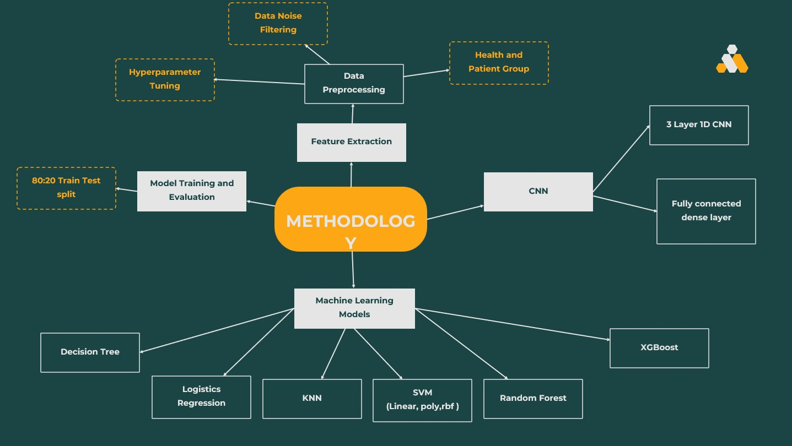

# EEG-Based Schizophrenia Detection: A Comparative Analysis of Machine Learning and Deep Learning Models

This repository contains the code and resources for the research paper titled, *"Comparative Analysis of Machine Learning and Deep Learning Models for EEG-Based Schizophrenia Detection"*. This project provides a comprehensive analysis of various machine learning and deep learning models for detecting schizophrenia using EEG data.

---

## 📜 Abstract

[cite_start]Psychiatric disorders demand enhanced diagnostics[cite: 8]. [cite_start]This research conducts a comparative analysis of machine learning and deep learning models for the detection of a specific mental disorder through EEG analysis[cite: 8]. [cite_start]Leveraging a dataset of EEG signals from schizophrenic patients, we employ eight distinct models, including Random Forest, K-Nearest Neighbors (KNN), XGBoost, Logistic Regression, Support Vector Machine (SVM), Decision Tree, and a Convolutional Neural Network (CNN)[cite: 9]. [cite_start]Our feature extraction process involves signal processing techniques, and the models are rigorously evaluated on their accuracy, precision, and recall[cite: 10]. [cite_start]The study aims to provide comparative insights into the efficiency of different modeling approaches in the challenging task of mental disorder detection using EEG data[cite: 11].

---

## 🛠️ Methodology

[cite_start]The methodology for this project involves a comprehensive analysis of Electroencephalogram (EEG) data to distinguish between healthy individuals and those diagnosed with schizophrenia[cite: 70]. The key steps are outlined below and visualized in the following flowchart:



### Data Preprocessing
* [cite_start]**Data Collection**: The dataset was compiled from a peer-reviewed journal, incorporating a patient group of 14 individuals with paranoid schizophrenia and a control group of 14 healthy individuals[cite: 63].
* [cite_start]**Data Filtering**: EEG data was filtered to isolate five distinct frequency bands using a second-order Butterworth filter[cite: 67].
* [cite_start]**Epoching**: EEG signals were segmented into fixed-length epochs of 5 seconds with a 1-second overlap[cite: 72].
* [cite_start]**Labeling**: The dataset was categorized into healthy and patient groups for supervised learning[cite: 73].

### Feature Extraction
[cite_start]A set of 7201 features was derived from various mathematical functions applied to the EEG epochs[cite: 74]. These features include:
* Mean
* Standard Deviation
* Peak-to-Peak
* Variance
* Minimum
* Maximum
* Argmin
* Argmax
* Mean Square
* Root Mean Square (RMS)
* Absolute Differences
* Skewness
* Kurtosis

### Model Training and Evaluation
* [cite_start]**Train-Test Split**: An 80:20 train-test split was implemented for robust model evaluation[cite: 75].
* **Machine Learning Models**:
    * [cite_start]Logistic Regression [cite: 81]
    * [cite_start]K-Nearest Neighbors (KNN) [cite: 81]
    * [cite_start]Support Vector Machine (SVM) with Linear and RBF kernels [cite: 81, 83]
    * [cite_start]Random Forest [cite: 81]
    * [cite_start]XGBoost [cite: 81]
    * [cite_start]Decision Tree [cite: 81]
* **Deep Learning Model**:
    * [cite_start]A three-layered 1D Convolutional Neural Network (CNN) was implemented[cite: 85].
* [cite_start]**Evaluation Metrics**: Models were evaluated based on accuracy, precision, and recall[cite: 93].

---

## 📊 Results

[cite_start]The performance of the models was assessed based on their ability to predict and classify schizophrenia from the test dataset[cite: 93]. The results are summarized below:

### Accuracy Comparison

| Model               | Accuracy (%) |
| :------------------ | :----------: |
| SVM (RBF)           | 96.56        |
| XGBoost             | 97.36        |
| Random Forest       | 96.04        |
| SVM (Linear)        | 92.01        |
| Logistic Regression | 90.40        |
| Decision Tree       | 88.34        |
| K-Nearest Neighbors | 83.92        |
| CNN                 | 95.00        |

### Model Performance Metrics

| Model               | Precision | Recall | Accuracy |
| :------------------ | :-------: | :----: | :------: |
| Logistic Regression |   0.917   | 0.907  |  0.904   |
| K-Nearest Neighbors |   0.839   | 0.874  |  0.839   |
| SVM (Linear)        |   0.932   | 0.922  |  0.920   |
| SVM (RBF)           |   0.975   | 0.962  |  0.966   |
| Random Forest       |   0.950   | 0.978  |  0.960   |
| XGBoost             |   0.976   | 0.976  |  0.974   |
| Decision Tree       |   0.898   | 0.884  |  0.883   |
| CNN                 |   0.993   | 0.747  |  0.950   |

---

## ⚙️ Dependencies

To run this project, you will need the following libraries:

* mne
* pandas
* numpy
* matplotlib
* scikit-learn
* xgboost
* tensorflow

You can install the necessary packages using pip:
```bash
!pip install mne
!pip install scikit-learn xgboost
